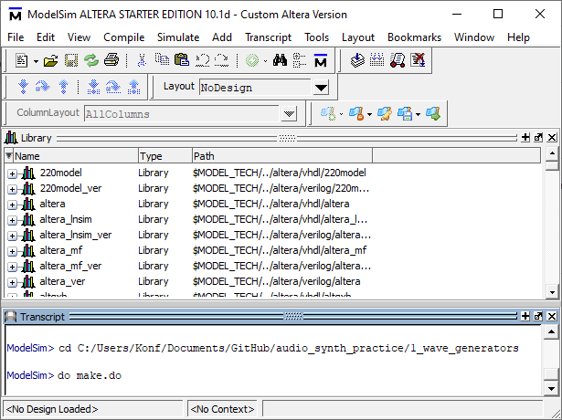
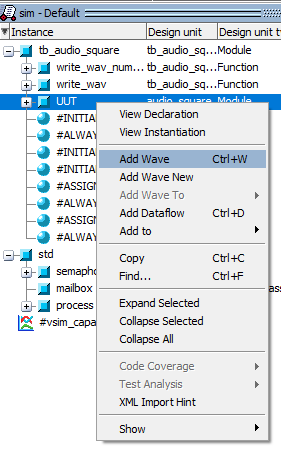
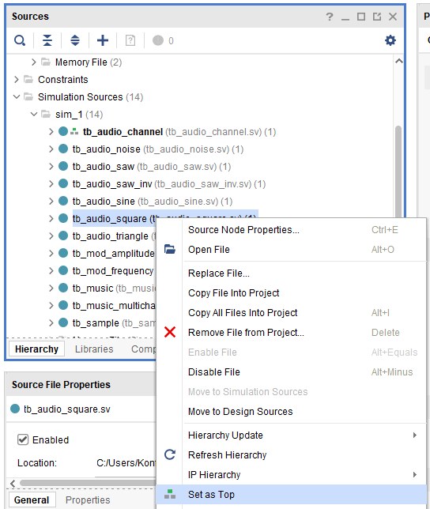
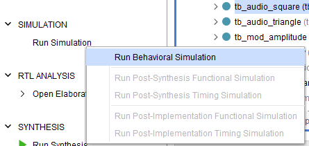
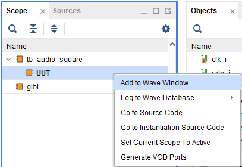
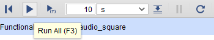

# Как запускать примеры

Данный документ описывает процесс запуска примеров.

Для разных примеров процесс запуска будет идентичен. В этом документе показан запуск примера "1.1. Генераторы простых форм сигнала - прямоугольная волна".

## Modelsim или Questa
1. Откройте Modelsim/Questa.
2. В TCL консоли в нижней части окна (Transcript) введите следующие команды:

```
cd C:/Users/Konf/Documents/GitHub/audio_synth_practice/1_wave_generators/1_square

do make.do
```



> Путь до папки с примером у вас будет свой, не забудьте поменять его!

> В каждом примере будет указан путь до папки, в которой находится `make.do` файл, запускающий пример. Для запуска конкретного примера вам необходимо будет поменять путь в первой строчке. Вторую строчку менять не нужно.

3. Добавьте на временные диаграммы сигналы, которые вы хотите пронаблюдать после моделирования (ПКМ по сигналу или модулю целиком, Add Wave)



1. Запустите моделирование командой `run -all` в TCL консоли.
2. Дождитесь окончания моделирования (моделирование может занимать несколько минут в зависимости от производительности вашего компьютера).
3. Если вы хотите поработать с симулятором (посмотреть временные диаграммы, например), ответьте "No" на вопрос "Are you sure you want to finish?"
4. Файл с результатом генерации звука можно найти по пути `audio_synth_practice/1_wave_generators/1_square/audio_square.wav`. Для других примеров файл будет иметь своё название и находиться в папке соответствующего примера.

## Vivado

1. Запустите скрипт `audio_synth_practice/vivado_project_lin.bash` (для Linux) или `audio_synth_practice/vivado_project_win.bat` (для Windows).
2. Скрипт создаст проект `audio_synth_practice/vivado_project/vivado_project.xpr`. Откройте этот проект в Vivado.
3. В списке файлов "Simulation Sources" выберите интересующий вам пример, кликните по нему ПКМ и выберите "Set as Top". **Обратите внимание на то, что для запуска других примеров вам не нужно создавать новый проект, достаточно поменять Top на другой и перезапустить моделирование!**



1. Запустите моделирование, выбрав "Simulation > Run Simulation > Run Behavioral Simulation"



5. Добавьте на временные диаграммы сигналы, которые вы хотите пронаблюдать после моделирования (ПКМ по сигналу или модулю целиком, Add to Wave Window)



6. Нажмите на кнопку "Run All"



7. Дождитесь окончания моделирования (моделирование может занимать несколько минут в зависимости от производительности вашего компьютера).

8. .wav файл с результатом генерации звука можно найти в папке `audio_synth_practice/vivado_project/vivado_project.sim/sim_1/behav/xsim/audio_square.wav`. Для других примеров файл будет иметь своё название, но находиться всегда будет в этой папке.
